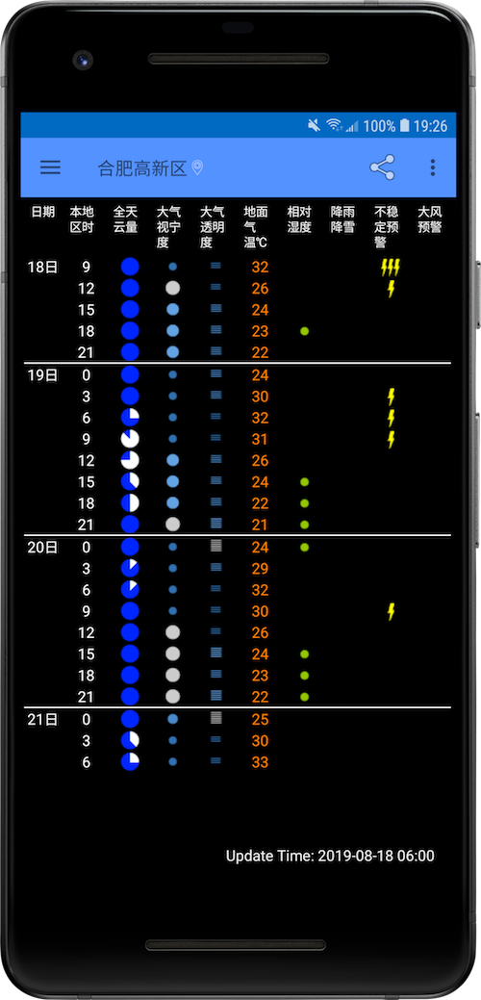
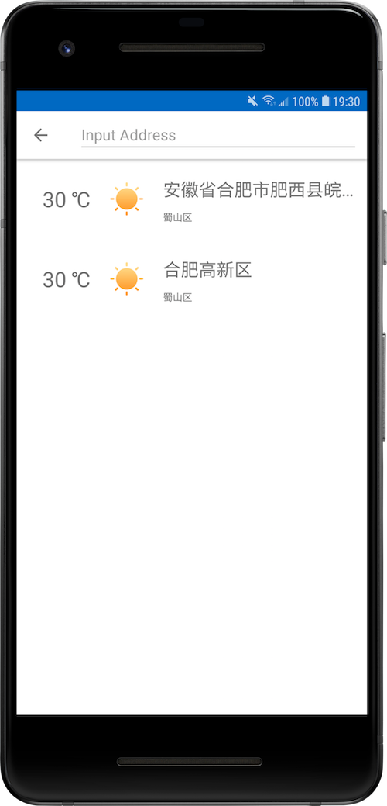

# SevenTimer
SevenTimer是一款Android端的开源天气APP, 目前仅支持晴天钟天气预测产品，该项目还在继续开发中。

# 架构
该项目基于MVP架构，以Material Design为设计风格。

### 要点
* 采用依赖注入框架Dagger2，提供Presenter、Model对象
* 使用Retrofit2和Rxjava2构建M层网络数据请求接口
* 在Presenter基类中实现Rxjava2订阅的管理
* 使用RxCache做API接口数据缓存
* 使用Google对象关系映射库Room实现持久化存储
* 使用RxPermission实现权限管理
* 调试工具采用了Pandora

### 包结构
~~~Java
-com.latitude.seventimer
     + base			// 各组件的基类
     + injector		// 依赖注入框架
     + model		// 数据层，从网络或者本地文件获取各种数据
     + support		// 各种自定义支持类
     + ui			// 功能模块，MVP架构中的V层和P层，包含Activity、Fragment和Presenter
     + util			// 工具类
     + widdget		// 自定义控件
~~~

# 数据接口说明
* 天文用途气象数据来自[晴天钟](http://www.7timer.info/doc.php?lang=zh-CN)公开接口。
* 地理编码信息来自[百度地图SDK](http://lbsyun.baidu.com/index.php?title=%E9%A6%96%E9%A1%B5)。


# 截图




# 开源协议 [](https://www.apache.org/licenses/LICENSE-2.0)

```
Copyright 2019 Cloud Ye

Licensed under the Apache License, Version 2.0 (the "License");
you may not use this file except in compliance with the License.
You may obtain a copy of the License at

   http://www.apache.org/licenses/LICENSE-2.0

Unless required by applicable law or agreed to in writing, software
distributed under the License is distributed on an "AS IS" BASIS,
WITHOUT WARRANTIES OR CONDITIONS OF ANY KIND, either express or implied.
See the License for the specific language governing permissions and
limitations under the License.
```


